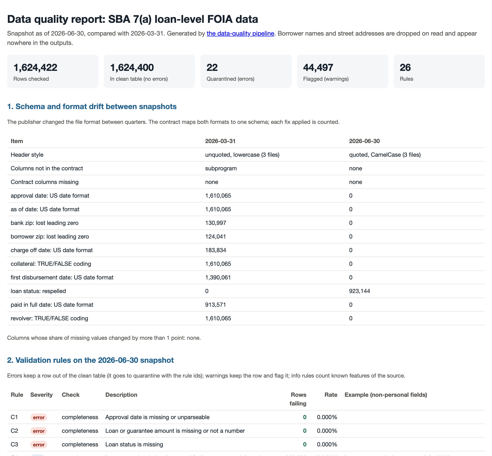

# Loan data quality pipeline: validating a 1.6-million-row public dataset that changes every quarter

[](https://github.com/Andresperez397/loan-data-quality-pipeline/actions/workflows/ci.yml)

## At a glance

- **Question:** What breaks, changes or goes missing when a public 1.6-million-row loan dataset is republished every quarter?
- **Answer:** SBA changed the file format between releases (124,041 ZIP codes lost a leading zero), 22 rows failed hard checks, 44,497 were flagged, 200 loans looked like revised copies of old ones, and 73 loans that had been resolved reopened.
- **Why it matters:** It is a pattern for any recurring data feed: a written contract, rule-based checks, quarantine of bad records and a release-to-release diff, with every number traceable.
- **Start here:** [Sample quality report (PDF)](reports/quality_report.pdf) · [the data contract](config/contract.yaml)


The U.S. Small Business Administration republishes its loan-level 7(a) data every quarter. Each release replaces the last, so a user who loads the new file has no record of what changed. This pipeline checks each release against a written data contract before anyone uses it:
- maps changing file formats to one schema and counts every fix
- runs 26 validation rules in SQL
- quarantines failed records with the rule that caught them
- compares the release with the previous quarter, loan by loan
- writes an HTML quality report and a machine-readable JSON file.

**Sample report:** [PDF](reports/quality_report.pdf) (opens on GitHub) · [HTML](reports/quality_report.html) (download and open in a browser) · [JSON](reports/quality_report.json)

**Data:** SBA 7(a) loan-level FOIA data, snapshots as of 2026-03-31 (1,610,065 loans) and 2026-06-30 (1,624,422 loans), public domain.
**Stack:** Python, DuckDB (SQL), YAML data contract, pytest, GitHub Actions.
**Works on any dataset:** nothing in `src/dq` is specific to loans. A second contract, for the UCI Online Retail II invoice lines, runs through the same code ([sample report](reports/online_retail/quality_report.html)).



## What it found in the June 2026 release

**1. The publisher changed the file format between quarters.**

| | March 2026 | June 2026 |
|---|---|---|
| Headers | unquoted, lowercase | quoted, CamelCase |
| Dates | US style (`3/31/2026`) | ISO (`2026-06-30`) |
| Yes/no fields | `TRUE` / `FALSE` | `Y` / `N` |
| ZIP codes | leading zero dropped (124,041 borrower ZIPs, e.g. `2134`) | five digits |
| Loan status | `PIF` | `P I F` (923,144 loans) |
| Extra column | `subprogram` | none |

A naive join of the two releases on the raw dates would match nothing, and one on ZIP codes would miss 124,041 loans. The contract maps both formats to one schema, and the report counts each fix.

**2. 22 rows are quarantined; 44,497 (2.7%) are flagged.**
- **Quarantined (errors):**
  - 20 loans have charged-off status but no charge-off date.
  - 2 cancelled loans have interest rates of 30.75% and 56%, outside any plausible range.
- **Flagged (warnings), largest first:**
  - NAICS industry code missing or malformed: 19,779
  - approval-time key shared with another loan, so the loan can't be tracked between releases: 16,509
  - charge-off amount above the loan amount: 5,267
  - term missing or implausible: 1,156
  - interest rate below 2%: 1,121
  - business type missing: 584
  - first disbursement before approval: 434
  - interest rate missing on a loan approved since FY2010: 8 (all FY2024–FY2026)
- **Known features of the source, counted but not failed:**
  - interest rate missing for 40% of loans, all but 8 of them approved through FY2009
  - a non-standard term on 25% of loans.

**3. Loan-by-loan changes: some "fixed" fields are not fixed.**
- **Matching:** 1,592,944 loans matched between the two releases. 14,969 are new (14,569 of them FY2026 approvals), and 662 disappeared.
- **Probable revisions:** 200 of the "new" loans match a disappeared loan on approval date, amount, ZIP and state. They are probably the same loan with a revised guarantee (120) or job count (81). The report counts them but does not merge them.
- **Fields that should not change** still changed for matched loans:
  - term: 1,287 loans (1,129 of them active)
  - business type: 154
  - NAICS code: 83
  - county: 24.
- **Resolved loans reopened:** 73 loans that were paid in full or charged off in March are active or undisbursed again in June. A resolved loan should not reopen, so these are worth raising with the publisher.

## How it works

```
contract.yaml ──► ingest ──► normalize ──► validate ──► split ──► diff ──► report
   (schema,       (all text,  (typed, every  (26 SQL     (clean /   (previous   (HTML +
    rules,         stable     fix counted)    rules,      flagged /  release)    JSON)
    PII flags)     row ids)                   per row)    quarantine)
```

- **Contract first.** [config/contract.yaml](config/contract.yaml) defines:
  - every column's canonical name, type and source header
  - which columns hold personal information
  - the allowed values
  - each rule as a SQL condition that is true when a row fails.

  Version 1.0 was committed before the first validation run. Every later change has a changelog entry:
  - **v1.1:** added the three freely associated states SBA serves (Marshall Islands, Micronesia, Palau), after the first run flagged 16 loans coded MH.
  - **v1.3:** no rule changed. Everything loan-specific in the diff and report moved into the contract's `compare`, `report` and `as_of` sections, so the same code runs any contract.
  - **v1.2:** fixed two descriptions that YAML had cut at a comma; a test now rejects any rule with an unexpected key. Also corrected the missing-rate rule's wording, and added a warning for missing rates on recent loans (8 found) and a looser key for reporting probable revisions.
- **Nothing coerced silently.** Raw files are read as text. Each normalization is explicit and counted: date formats, yes/no codes, status spellings, ZIP padding. Values that fail to parse are counted separately.
- **Three severities:**

  | Severity | What happens to the row |
  |---|---|
  | error | quarantined, with the ids of the rules it failed |
  | warning | kept in the clean table with a flag and the rule ids |
  | info | counted only (known properties of the source) |
- **Matching without personal data.** Loans are matched between releases on fields fixed at approval: approval date, amounts, ZIP, state, jobs and interest rate. Names are not used. A key shared by several loans is reported as untrackable instead of guessed.
- **Personal data never leaves the pipeline.** Borrower names and street addresses are read only to be dropped. Tests check that no fixture name or address appears in any output.
- **Deterministic outputs.** The same input always produces byte-identical reports. Rule examples and ties are ordered explicitly.

## A second dataset: the same pipeline, a different contract

[examples/online_retail/contract.yaml](examples/online_retail/contract.yaml) describes the Online Retail II invoice lines (two sheets treated as two releases). The only change from the loan run is the contract:

```bash
python examples/online_retail/prepare_data.py            # downloads the workbook, writes two CSV releases
PYTHONPATH=src python -m dq.cli --current data/retail/release_2010_2011.csv \
  --previous data/retail/release_2009_2010.csv --contract examples/online_retail/contract.yaml --out output/retail
```

On 541,910 lines it quarantines 2 (negative unit prices, the "adjust bad debt" entries), flags 12,658 (1,454 without a description, 1,336 negative-quantity write-offs on non-cancellation invoices, 1,179 free items, 10,153 lines repeated within the day) and counts 135,080 lines without a customer ID as known. The diff finds exactly what the file's structure predicts: the later release repeats the first nine days of December 2010, so 21,906 lines match and the rest appear in one release only.

## Tests

Two small synthetic releases in [tests/fixtures](tests/fixtures), one in each real file format, carry planted problems: a guarantee above the loan amount, an invalid state, an unparseable date, a charge-off date without charged-off status, an out-of-range rate, a future approval date, a low rate, a bad NAICS code, a duplicate key, a dropped ZIP leading zero, a missing rate on a recent loan, a rewritten term, a reopened loan, a revised key field and a missing required column. The 24 tests check that:
- both formats map to the contract and each fix is counted
- each planted problem is caught by its rule, and clean loans fail nothing
- quarantine holds exactly the error rows, with the right rule ids
- the snapshot diff finds the new, removed, changed, reopened and probably revised loans
- a missing required column stops the run
- outputs contain no personal fields, and the JSON is strict (no `NaN`)
- a second contract (retail) finds its own planted problems through the same code, with contract-driven report wording.

Building the tests and rerunning the full data surfaced three bugs, each now covered:
- a crash when a column was empty in every row (found by the fixtures)
- `NaN` written into the JSON, which strict parsers reject
- rule examples that changed from run to run.

CI runs lint, format and tests on every push, and checks that the committed fixtures match their generator.

## Run it

```bash
python -m venv .venv && .venv/bin/pip install -r requirements.txt
.venv/bin/python scripts/fetch_data.py          # 1.4 GB; verifies SHA-256 checksums
PYTHONPATH=src .venv/bin/python -m dq.cli \
  --current 'data/raw/*asof_260630.csv' --previous 'data/raw/*asof_260331.csv' --out output
.venv/bin/python -m pytest -q
```

The full run takes about a minute on a laptop. It writes `output/quality_report.html`, `quality_report.json`, `clean.parquet` (no personal fields, with warning flags) and `quarantine.parquet`. SBA may remove older releases; the checksums in `scripts/fetch_data.py` identify the exact files behind the sample report.

## Limitations

- **Matching:** a revised key field breaks the match. The looser key finds 200 probable revisions, but that leaves 462 removed loans with no counterpart. Revisions to the amount, date, ZIP or state cannot be told apart from removals and additions without a loan identifier, which the public file does not include.
- **Thresholds are judgment calls,** written down in the contract: a rate below 2% is flagged, not failed. A business would set them with the data's owners.
- **Two releases only.** The pipeline compares two releases at a time; a longer history would show whether the reopened loans and rewritten terms are recurring.

## Repository layout

```
config/contract.yaml      data contract: schema, PII flags, allowed values, rules, changelog
src/dq/                   ingest.py, validate.py, diff.py, report.py, cli.py (all contract-driven)
examples/online_retail/   a second contract and its data-preparation script
tests/                    synthetic fixtures with planted problems, pytest suite
scripts/fetch_data.py     download and checksum the two releases
reports/                  sample report (HTML, PDF, JSON, preview image)
```

## Data and license

- **Data:** U.S. Small Business Administration 7(a) loan-level FOIA data (U.S. Government Works, public domain). Raw files are not committed; `scripts/fetch_data.py` downloads them and checks their SHA-256 checksums. Borrower names and street addresses are never written to any output.
- **Code:** MIT (see `LICENSE`).
- **Affiliation:** not affiliated with or endorsed by the SBA.
